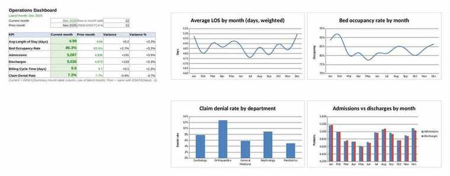
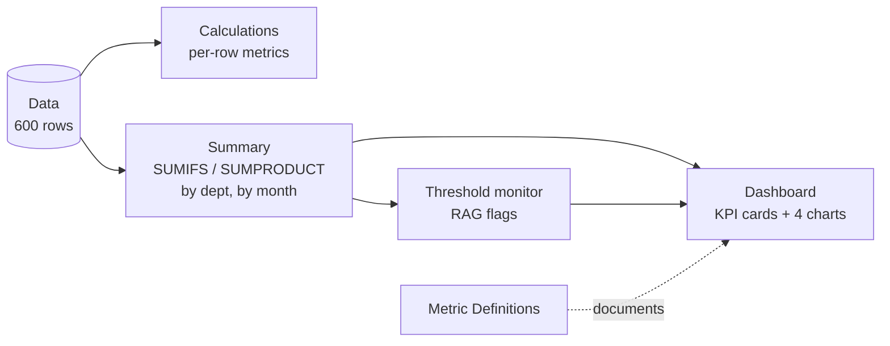
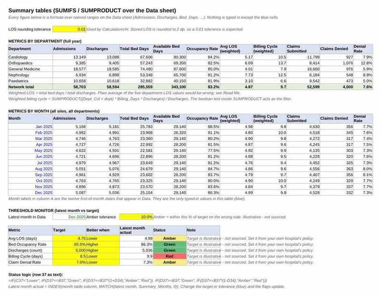
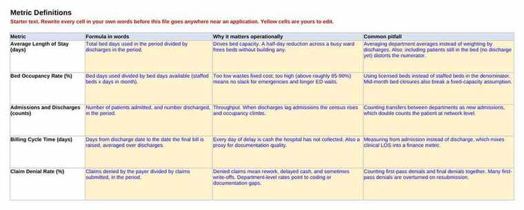

<div align="center">

# Hospital Operations KPI Dashboard

**Five operational metrics for a ten-site hospital network, from raw table to one-page dashboard, in plain Excel.**


## At a glance

| | |
|---|---|
| **Scope** | 10 sites × 5 departments × 12 months (Jan to Dec 2025), 600 department-month records |
| **Metrics** | Average length of stay, bed occupancy, admissions and discharges, billing cycle time, claim denial rate |
| **Reporting layer** | `SUMIFS` and `SUMPRODUCT` summaries by department and by month, discharge-weighted where it matters |
| **Monitoring** | Threshold table with editable targets and red / amber / green flags |
| **Output** | Six KPI cards (current vs prior month) and four native Excel charts |
| **Skill level** | Intermediate Excel: `SUMIFS`, `SUMPRODUCT`, `INDEX/MATCH`, `IFERROR`, named ranges, conditional formatting, charts |



---

## The five metrics

| # | Metric | Definition | Why it matters |
|---|---|---|---|
| 1 | **Average Length of Stay** (days) | Total bed days ÷ discharges | Drives bed capacity. Half a day off a busy ward frees beds without building any |
| 2 | **Bed Occupancy Rate** (%) | Bed days used ÷ available bed days (staffed beds × days in month) | Too low wastes fixed cost; too high leaves no slack for emergencies |
| 3 | **Admissions and Discharges** (counts) | Patients in and patients out per month | When discharges lag admissions, census and occupancy climb |
| 4 | **Billing Cycle Time** (days) | Days from discharge to final bill | Every day of delay is uncollected cash; also a proxy for documentation quality |
| 5 | **Claim Denial Rate** (%) | Claims denied ÷ claims submitted | Rework, delayed cash, write-offs. Department-level rates point to coding gaps |

---

## How the workbook flows



| Sheet | What it holds |
|---|---|
| **Read Me** | Purpose, metric definitions, colour legend, disclaimer |
| **Data** | 600 synthetic rows. Values only, no formulas. Named ranges on every column |
| **Calculations** | Per-row occupancy, denial rate, discharge variance, and an LOS reconciliation check. All formulas |
| **Summary** | Metrics by department, metrics by month, and the threshold monitor |
| **Dashboard** | KPI cards for the latest month against the prior month, plus four charts |
| **Metric Definitions** | One row per metric: formula in words, why it matters, common pitfall. **Rewrite in your own words before using.** |

---

## The analytical point worth raising in interview

Average LOS across departments is a **weighted** average (total bed days ÷ total discharges), not a plain average of the five department figures. A plain average would let a 40-discharge Nephrology row count as much as a 180-discharge General Medicine row.

The Summary sheet does the same for billing cycle time with `SUMPRODUCT`, using a boolean test as the filter:

```excel
=SUMPRODUCT((Dept_Col = $A8) * Billing_Days * Discharges) / SUMIFS(Discharges, Dept_Col, $A8)
```

This is the same idea as a PivotTable weighted-average calculated field, written out so it can be explained line by line.

---

## Threshold monitor

Targets, the "better when" direction, and the amber tolerance are all blue input cells. One formula produces the flag; conditional formatting colours it:

```excel
=IF(C37="Lower",
    IF(D37<=B37, "Green", IF(D37<=B37*(1+D34), "Amber", "Red")),
    IF(D37>=B37, "Green", IF(D37>=B37*(1-D34), "Amber", "Red")))
```

The "latest month actual" column is an `INDEX/MATCH` into the by-month table keyed on `MAX(Month_Col)`, so appending a new month of data rolls the whole monitor forward automatically.



---

## The synthetic data

Generated by `build_hospital_dashboard.py` with a fixed random seed, so it is reproducible.

| Design choice | Detail |
|---|---|
| Department profiles | Nephrology has the longest stays, Orthopaedics the highest denial rate, Paediatrics the shortest stays, General Medicine the highest volume |
| Seasonality | Mild winter and monsoon bumps in admissions, slightly longer stays in winter |
| Internal consistency | Stored LOS equals bed days ÷ discharges to 2 dp; bed days never exceed available bed days; denials never exceed submissions. The Calculations sheet re-derives LOS and flags any drift |
| Why 10 sites | The brief asked for ~600 rows. Five departments × twelve months is only 60, so the table is modelled as a ten-site network. Every row is still a meaningful department-month record |

Public datasets with a similar shape, if you want to swap in something closer to real (none carries all five metrics, and none includes billing or claims fields):

- Kaggle, *Hospital Beds Management*: https://www.kaggle.com/datasets/jaderz/hospital-beds-management
- Kaggle, *Hospital bed Occupancy Data*: https://www.kaggle.com/datasets/sakthikeerthanak/hospital-bed-occupancy-data
- Kaggle, *Hospital Length of Stay Dataset (Microsoft)*: https://www.kaggle.com/datasets/aayushchou/hospital-length-of-stay-dataset-microsoft

---

## Metric Definitions sheet

Starter text only. Rewrite every cell in your own words before this file goes anywhere near an application.



---

## Conventions

| Element | Convention |
|---|---|
| Blue text on yellow | Input you may change (targets, direction, tolerance) |
| Black text | Calculated on this sheet |
| Green text | Pulled from another sheet |
| Percentages | `0.0%`, stored as fractions |
| Font | Arial throughout |
| Functions | `SUMIFS`, `SUMPRODUCT`, `INDEX`, `MATCH`, `IFERROR`, `IF`, `MAX`, `EDATE`, `ABS`. No XLOOKUP, no array formulas, no macros, no Power Query |
| Named ranges | One per Data column (`Admissions`, `Discharges`, `Bed_Days`, `Dept_Col`, `Month_Col`, ...) so every `SUMIFS` reads like a sentence |
| Charts | Native Excel charts driven by the Summary tables |

A PivotTable on the Data sheet can be added in Excel in two clicks (Insert > PivotTable). It is not generated here because openpyxl cannot write pivot caches.

---

## Rebuild from source

```bash
pip install openpyxl numpy
python build_hospital_dashboard.py
```

Every derived cell is written as a formula string, never a Python-computed value. The committed `.xlsx` has been recalculated and checked: 5,021 formulas, 0 errors.

## Repository layout

```
hospital-operations-kpi-dashboard/
├── hospital_operations_dashboard.xlsx   # the dashboard
├── build_hospital_dashboard.py          # generates the data and rebuilds the workbook
├── shots/                               # sheet screenshots used above
└── README.md
```
